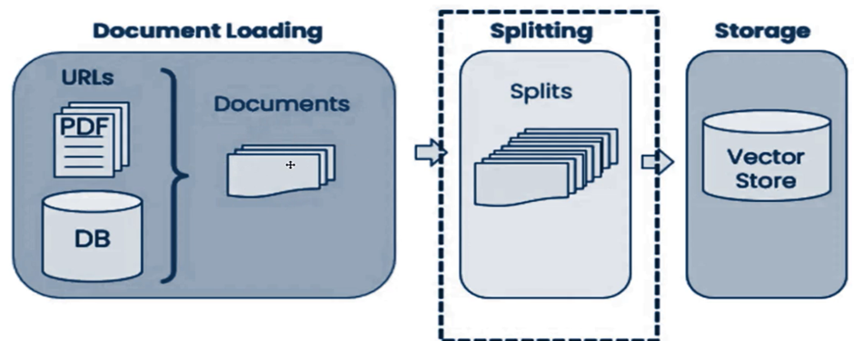
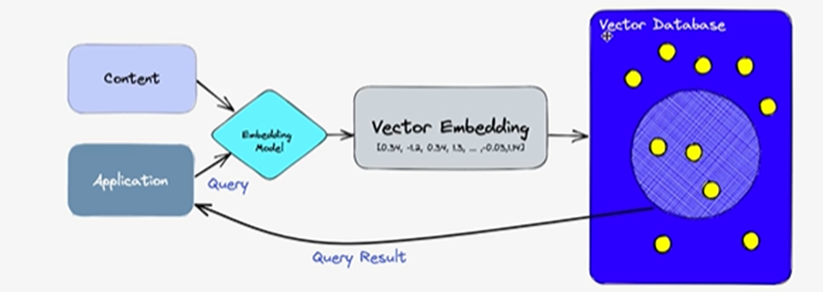

# RAG Model for Indian Property Law Analysis

## Table of Contents
1. [Problem Statement](#problem-statement)
2. [Context](#context)
3. [Use Case](#use-case)
4. [Our Solution](#our-solution)
5. [Technical Implementation](#technical-implementation)
6. [Key Features](#key-features)
7. [Data Flow](#data-flow)
8. [Challenges](#challenges)
9. [Future Enhancements](#future-enhancements)

## Problem Statement

Legal professionals in India face significant challenges when researching and analyzing property dispute cases due to the complexity and multifaceted nature of Indian property law. This process is often time-consuming and may lead to overlooked relevant information, potentially affecting the quality of legal advice and representation.

## Context

The Indian legal system, particularly in the domain of property law, involves numerous statutes, case laws, and state-specific regulations. Legal professionals spend considerable time researching relevant precedents and statutes for property dispute cases. This manual research process can be inefficient and may not always capture all relevant information.

## Use Case

Consider a scenario where a lawyer is presented with a case involving a tenant refusing to vacate a property in Mumbai after lease expiration, with the landlord seeking repossession. The lawyer needs to quickly understand:

1. Relevant sections of the Maharashtra Rent Control Act
2. Recent precedents set by the Bombay High Court and Supreme Court in similar cases
3. Any specific local regulations that might apply

## Our Solution

We are developing a Retrieval-Augmented Generation (RAG) model that will revolutionize how legal professionals approach property law research and analysis in India. Our solution combines advanced natural language processing techniques with a comprehensive database of Indian legal documents to provide rapid, accurate, and context-aware legal insights.

Key components of our solution include:

1. **Comprehensive Legal Database**: A curated collection of Indian property laws, case precedents, and legal documents.
2. **Advanced Retrieval System**: Utilizes state-of-the-art embedding techniques and similarity search to find the most relevant legal information.
3. **Intelligent Analysis Engine**: Leverages large language models to generate insightful legal analysis based on retrieved information.
4. **User-Friendly Interface**: Allows legal professionals to input case details and receive comprehensive reports easily.

## Technical Implementation

Our RAG model leverages the following technologies:

- **Language Model**: OpenAI API or Google Gemini Model API for generating embeddings and final analysis
- **Vector Database**: Pinecone for efficient similarity search of legal document embeddings
- **Frontend**: Streamlit, Flask, or Tkinter (to be decided) for creating an intuitive user interface

## Key Features

1. **Information Retrieval**: Accurately retrieve relevant case laws, statutes, and legal principles from our comprehensive database of Indian legal documents.
2. **Case Law Analysis**: Identify and summarize the most pertinent previous court decisions, highlighting key legal principles.
3. **Statutory Interpretation**: Identify and explain relevant sections of key property-related acts (e.g., Transfer of Property Act, 1882; Land Acquisition Act, 2013).
4. **Preliminary Legal Analysis**: Generate a preliminary analysis of how relevant case laws and statutes might apply to the given property dispute scenario.

## Data Flow

1. **Data Collection and Preprocessing**
2. **Embedding Generation**
3. **Vector Database Creation**
4. **Query Processing**
5. **Retrieval**
6. **Generation**
7. **Output**

## Future Enhancements

1. **Extend to Other Types of Cases**
- Expand the RAG model to cover other areas of law, such as family law, criminal law, and corporate law.
- Incorporate a wider range of legal documents, including law commission reports, legal articles, and government notifications.

2. **Interactive Q&A**
- Implement a question-answering system that allows users to ask specific legal questions and receive instant answers based on the RAG model's analysis.

3. **Integration with Legal Research Platforms**
- Integrate the RAG model with existing legal research platforms to enhance their capabilities and provide users with more comprehensive legal insights.

