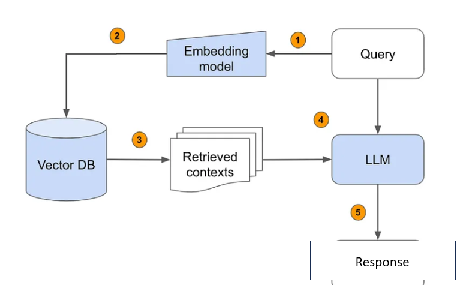
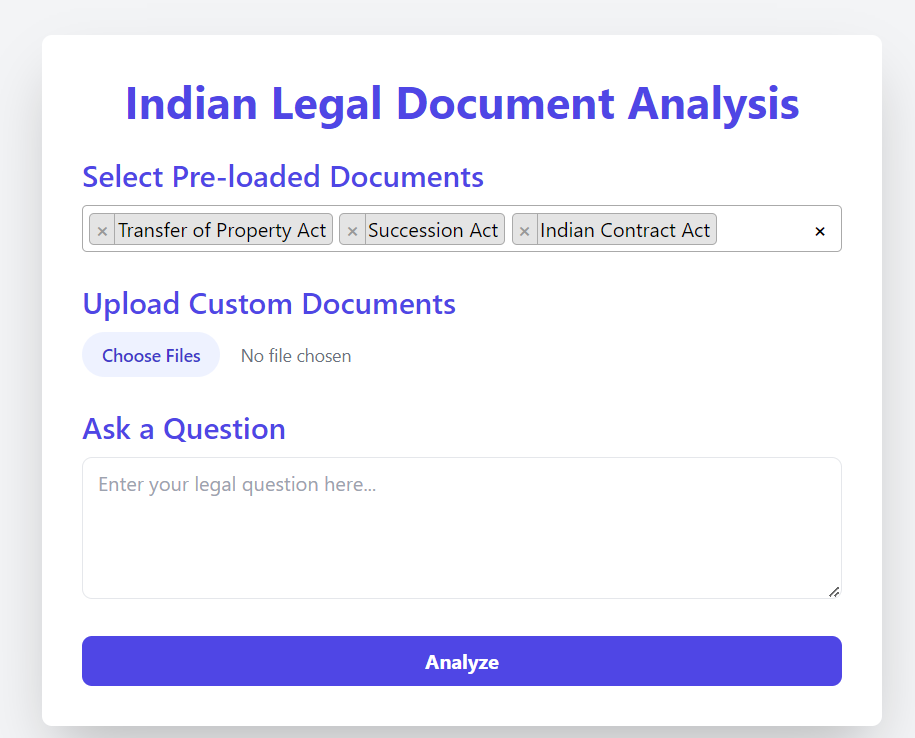

# User-Centric RAG Model for Indian Legal Document Analysis

## Table of Contents
1. [Problem Statement](#problem-statement)
2. [Context](#context)
3. [Use Case](#use-case)
4. [Our Solution](#our-solution)
5. [Technical Implementation](#technical-implementation)
6. [Key Features](#key-features)
7. [Data Flow](#data-flow)
8. [Challenges](#challenges)
9. [Future Enhancements](#future-enhancements)

## Problem Statement

Legal professionals and researchers in India need an efficient way to analyze specific legal documents relevant to their work. The current process of manually reviewing documents is time-consuming and may lead to overlooked information. There's a need for a system that allows users to select from pre-loaded legal documents and upload their own, then interact with this information through a chatbot interface.

## Context

The Indian legal system involves numerous statutes, acts, and case laws. Efficient analysis of these documents is crucial for effective legal work. This system aims to streamline this process by providing a user-centric approach to document selection and analysis.

## Use Case

A lawyer is preparing for a property dispute case. They need to review:

1. Relevant sections of the Transfer of Property Act related to the case
2. Questions regarding Succession Act or any other relevant acts

Using our system, the lawyer can:
1. Select the Transfer of Property Act and Succession Act from pre-loaded documents
2. Upload any other relevant documents/pds if required
3. Use the QA bot to ask specific questions about these documents and how they relate to their case

## Our Solution

We are developing a user-centric Retrieval-Augmented Generation (RAG) model that revolutionizes how legal professionals approach document analysis in India. Our solution combines advanced natural language processing with a flexible document selection system and an interactive QA bot interface.

Key components of our solution include:

1. **Pre-loaded Legal Document Library**: 
- It includes a number of documents such as the Transfer of Property Act, succession act etc. related to property law in India.
2. **User Document Upload**: Capability for users to upload their own documents for analysis.
3. **Document Selection Interface**: Allows users to choose which documents to include in their analysis session.
4. **Advanced Retrieval System**: Utilizes state-of-the-art embedding techniques and similarity search to find relevant information.
5. **Interactive Chatbot**: Leverages large language models to answer user queries based on selected documents.

## Technical Implementation

## Architecture Diagram

## Initial frontend design

The system leverages the following technologies:

- **Language Model**: OpenAI API or Google Gemini Model API for generating embeddings and powering the chatbot
- **Vector Database**: Pinecone for efficient similarity search and storage of legal document embeddings
- **Frontend**: Flask, HTML, CSS, for creating an intuitive user interface

## Key Features

1. **Document Selection**: Users can select from pre-loaded legal documents and upload their own.
2. **Interactive Querying**: Users can ask questions about selected documents through a chatbot interface.
3. **Contextual Understanding**: The system understands and responds to queries in the context of selected documents.
4. **Information Synthesis**: Provides answers that synthesize information from multiple selected documents when relevant.

## Data Flow

1. **Document Preparation**: Pre-load common legal documents into the vector database.
2. **User Interaction**: Users select documents and/or upload their own through the frontend.
3. **Document Processing**: Newly uploaded documents are processed and added to the session's vector database.
4. **Query Processing**: User queries are processed and relevant information is retrieved from selected documents.
5. **Response Generation**: The chatbot generates responses based on retrieved information and its language model.

## Future Enhancements

1. **Extend to Other Types of Cases**
- Expand the RAG model to cover other areas of law, such as family law, criminal law, and corporate law.
- Incorporate a wider range of legal documents, including law commission reports, legal articles, and government notifications.

2. **Interactive Q&A**
- Implement a question-answering system that allows users to ask specific legal questions and receive instant answers based on the RAG model's analysis.

3. **Integration with Legal Research Platforms**
- Integrate the RAG model with existing legal research platforms to enhance their capabilities and provide users with more comprehensive legal insights.

